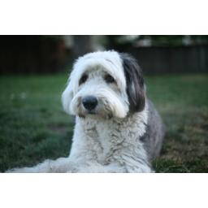

# maddiecnn
## Goals
Identify my 4 dogs using convolutional neural network (CNN) from 3000+ photos using Keras-based convolutional neural network.

## Dataset

|  Name | Sample photo from the dataset  |
|---|---|
| Aimee |  |
| Maddie |  |
| Olivia |  |
| Pink |  |

## Classification criteria
Criteria for the presence of the dog
For each dog, if one of the eyes and at least a part of the tip of the nose are in the photo, the dog is considered present in the photo and marked as such.

## How each photo in the dataset is marked

<Name prefixes>_<5 digit zero-padded number>.png

| Prefix | Description
|---|---|
| m | Maddie |
| o | Olivia |
| p | Pink |
| a | Aimée |

If the photo does not contain any of the dogs above, the file name will be _<5 digit zero-padded number>.png.

Upon data load, this will be converted to a following vector:

| Vector element | Value |
|---|---|
|0|0 or 1.0|
|1|0 or 1.0|
|2|0 or 1.0|
|3|0 or 1.0|
